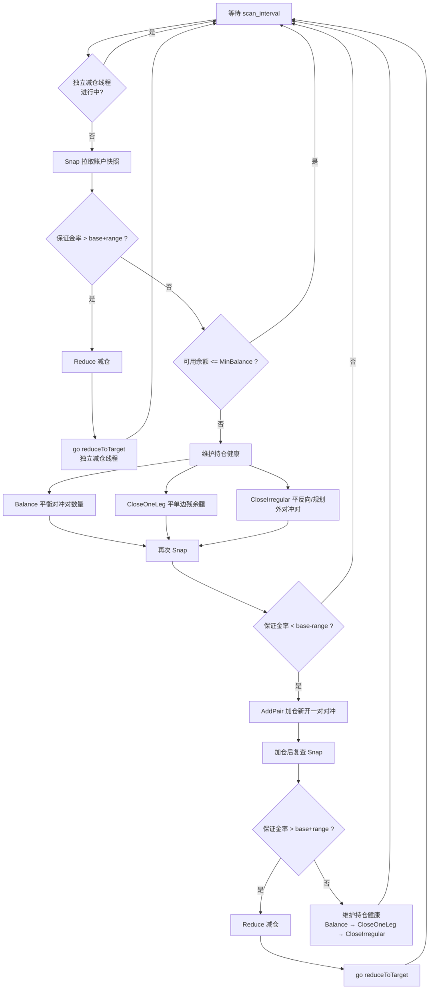
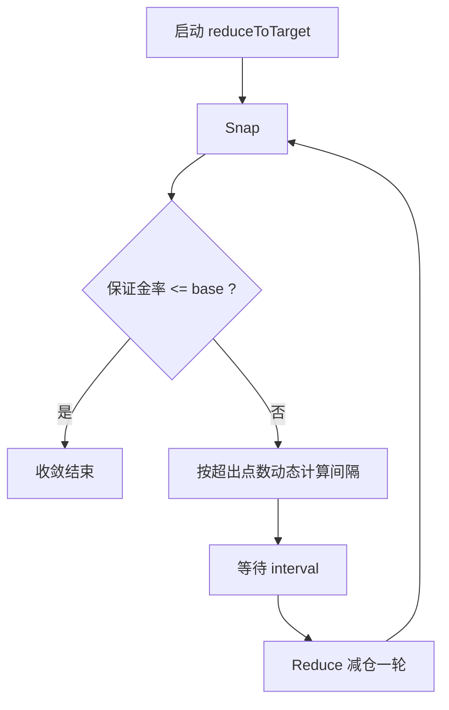
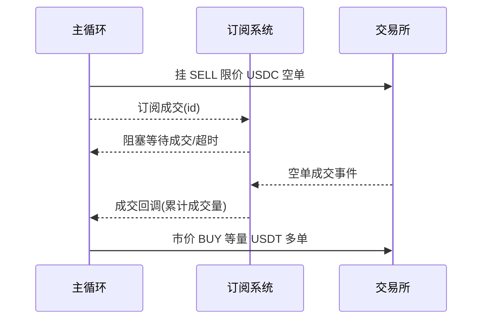

# Hedge — Binance USD-M 双向持仓对冲机器人

基于 Binance USD-M 期货（USDT/USDC 本位合约）的**双向持仓对冲**交易程序。程序自动为每个规划币种建立「USDC 空单 + USDT 多单」对冲对，并持续把账户**保证金比率**维持在配置的基准点附近。

---

## 一、核心交易策略

### 1.1 双向对冲对模型

每个规划币（`plans`）构成一个**对冲对**，由两条腿组成：

| 腿 | 方向 | 作用 |
|----|------|------|
| USDC 腿 | **空单（SHORT）** | 主要做空敞口 |
| USDT 腿 | **多单（LONG）** | 与 USDC 空单等量对冲 |

两条腿**数量基本相等**，价格涨跌时一侧亏损、另一侧盈利互相抵消，主要赚取两者之间的价差/资金费率差，同时控制方向性风险。

> 开仓固定为「C 空 T 多」正向对冲对；若账户中出现反向对冲对（USDC 多 + USDT 空），会被视为异常持仓并平掉。

### 1.2 保证金基准点控制（核心目标）

程序用**保证金比率**作为风控和调仓的核心信号：

```
保证金比率 = 维持保证金(MaintMargin) / 钱包余额(WalletBalance) × 100
```

- 基准点 `margin.base = 55`（即 0.55%）
- 带宽 `margin.range = 5`

| 区间 | 判定 | 动作 |
|------|------|------|
| 比率 > `base + range`（>60） | 保证金占用过高 | **减仓**释放保证金 |
| 比率 < `base - range`（<50） | 保证金占用过低 | **加仓**（开一对新对冲） |
| 其余区间 | 正常 | 维护持仓健康（平衡 / 平单边 / 平异常） |

---

## 二、主循环逻辑链路

`RebalanceLoop` 是每个账户的核心主循环（`rebalance.go`），整体流程如下：



关键点：

1. **快照** `Snap()`：从 `WsApi.Account` 拉取余额、未实现盈亏、保证金比率，并按基础币把 USDC/USDT 两条腿聚合成 `pos`（对冲对）。
2. **减仓独占**：触发减仓后会启动独立的 `reduceToTarget` 线程，期间主循环会等待其收敛结束，避免并发下单。
3. **加仓后复查**：加仓会占用更多保证金、推高保证金率，因此加仓后立即复查快照，若比率反超减仓阈值则立即减仓。
4. **健康维护三步**：平衡 → 平单边 → 平异常，各步之间按 `step_pause` 停顿，避免瞬时请求过多。

### 2.1 独立减仓线程 `reduceToTarget`



- 减仓间隔**动态衰减**：`interval = base × (1 - reduce_cut × 超出点数)`，超出基准越多减得越频繁；当 `reduce_cut × 超出点数 ≥ 1` 时立即连续减仓（间隔 0）。

---

## 三、策略模块详解

### 3.1 加仓 `AddPair` / `addPair`（`add_pair.go`）

**触发**：保证金率低于 `base - range`。

**选币**：在 `plans` 规划中挑**当前持仓价值最小**的币（未持仓按 0 计）。

**约束**：
- 持仓价值 ≥ `cap × cap_ratio`（持仓已达上限）→ 不加仓
- 可用余额 ≤ `add.min_balance` → 不加仓

**执行**（开一对新对冲）：
1. 取 USDC **卖盘第二档价**（`Depth` 的 `Asks[1]`）作为限价；
2. 订阅订单成交事件（`Subscribe`），等待成交回调；
3. 挂 **SELL 限价** USDC 空单，金额 = `plan.usdt`；
4. 阻塞等待成交（或超时 `add.timeout`=30s 撤销挂单）；
5. 成交回调内 **市价 BUY** 开等量 USDT 多单，保持两边平衡。



### 3.2 减仓 `Reduce` / `reducePair`（`reduce_pair.go`）

**触发**：保证金率高于 `base + range`。

**选币**：在所有 **USDC 空单**持仓中找**未实现盈亏最大**的币（已实现盈利越多越优先兑现）。

**执行**（异步 `go reducePair`）：
1. **市价 BUY** 平 USDC 空单；
2. 名义价值 > `reduce.step_notional`(240) 时，用 `step_usdt`(200) ÷ 盘口卖一价（`Book.AskPrice`）换算数量分批减，否则**全平**；
3. `RespType("RESULT")` 让返回带成交量，取 `OrigQty` 作为实际减仓量；
4. **市价 SELL** 同步减等量 USDT 多单（封顶 `usdt.qty`，避免反手）。

> 纯市价流，不订阅成交、不超时撤销。

### 3.3 平衡 `Balance` / `balancePair`（`balance_pair.go`）

**触发**：主循环健康维护阶段。

**对象**：正向对冲对（USDC 空 + USDT 多）且两边**数量不一致**（差 > 1e-8）。

**执行**（异步 `go balancePair`）：找出数量多的一边，**市价**平掉差额（空单→BUY，多单→SELL），使两边数量重新一致。

### 3.4 平单边 `CloseOneLeg` / `closeLeg`（`close_leg.go`）

**触发**：主循环健康维护阶段。

**对象**：对冲对中一条腿已清空（数量为 0）、另一条腿仍有持仓 → **对冲已失效**，平掉残余单边腿。

**执行**（异步 `go closeLeg`）：
- 方向由持仓方向推导：`SHORT → BUY` 买回，`LONG → SELL` 卖出，方向未知跳过；
- 名义价值 > `close.step_notional` 时按盘口价（`Book`，平 SHORT 取 `AskPrice`、平 LONG 取 `BidPrice`）把 `step_usdt` 换算数量分批平，否则**全量市价平**。

### 3.5 平异常对冲对 `CloseIrregular`（`close_pair.go`）

**触发**：主循环健康维护阶段。

**对象与处理**：

| 持仓形态 | 判定 | 处理 |
|----------|------|------|
| 反向对冲对（USDC 多 + USDT 空） | 与开仓方向相反 | `closeInverted` 平掉 |
| 正向对冲对（USDC 空 + USDT 多）且**不在规划内** | 规划外持仓 | `closePair` 平掉 |
| 正向对冲对且在规划内 | 正常持仓 | 保留 |

**`closePair`（平正向对冲对，限价）**：
1. 取 USDC **卖盘第二档价**（`Asks[1]`）为限价（平仓 BUY → Ask）；
2. 订阅成交；挂 **BUY 限价** 平 USDC 空单（名义价值 > `close.step_notional` 按 `step_usdt` 分批，否则全平）；
3. 成交回调内 **市价 SELL** 平等量 USDT 多单；
4. 超时 `close.timeout`=10s 撤销挂单。

**`closeInverted`（平反向对冲对，限价）**：
1. 取 USDC **买盘第二档价**（`Bids[1]`）为限价（平仓 SELL → Bid）；
2. 订阅成交；挂 **SELL 限价** 平 USDC 多单；
3. 成交回调内 **市价 BUY** 平等量 USDT 空单；
4. 超时撤销挂单。

> 挂限价单 + 订阅成交的流程为**同步**执行（阻塞等待成交/超时，确保平对完成再返回）；纯市价流（closeLeg / balancePair / reducePair）为**异步**执行。

---

## 四、下单与成交同步机制

### 4.1 挂限价单取价规则

所有限价单价格统一取**盘口第二档**（`Depth`，5 档），方向规则：

| 动作 | 方向 | 取价 |
|------|------|------|
| 开仓 SELL（USDC 空单） | 卖 | 卖盘二档 `Asks[1]` |
| 平仓 BUY（买回空单） | 买 | 卖盘二档 `Asks[1]` |
| 平仓 SELL（卖出多单） | 卖 | 买盘二档 `Bids[1]` |

盘口只有一档时回退到最优档；空盘报错。实现于 `hedge.depthLevel()`。

市价流（closeLeg / reducePair）的数量换算用 `Book()`（ticker.book）：平 SHORT→BUY 取 `AskPrice`、平 LONG→SELL 取 `BidPrice`。

### 4.2 成交订阅与超时撤销

`exchange.UserData` 提供基于用户数据流的**订单成交订阅系统**：

```
Subscribe(clientOrderID, status, 成交回调, 超时, 超时回调) → done channel
```

- 挂限价单前先订阅，下单成功后 `<-done` **阻塞等待**；
- 成交事件到达 → 执行成交回调（同步市价腿）→ 关闭 done；
- 超时未成交 → 撤销挂单 → 关闭 done；
- 下单失败 → `Unsubscribe` 取消订阅。

每个订单有唯一 `clientOrderID`（`exchange.GenID()`），订阅 key = `ClientOrderID + "-" + 状态值`（2 = 全部成交）。

### 4.3 并发模型

| 流类型 | 处理 |
|--------|------|
| 挂限价单 + 订阅成交（openPair / closePair / closeInverted） | 同步，阻塞等成交 |
| 纯市价流（closeLeg / balancePair / reducePair） | `go` 异步 |
| 独立减仓线程 `reduceToTarget` | `go` 异步，主循环等待 |

减仓期间通过 `reduceMu` / `reducing` 互斥，保证主循环不与减仓线程并发下单。

---

## 五、框架结构

### 5.1 目录结构

```
Hedge/
├── main.go               # 入口：加载配置、初始化交易所、启动各账户主循环、退出清理
├── config.go             # 配置结构 + LoadConfig + 默认值填充/校验
├── hedge.go              # 核心结构 hedge/leg/pos/snap + Snap() + 工具函数 + depthLevel
├── rebalance.go          # 再平衡主循环 + reduceToTarget 独立减仓线程
├── add_pair.go           # 加仓：AddPair / addPair（开一对新对冲）
├── reduce_pair.go        # 减仓：Reduce / reducePair（释放保证金）
├── balance_pair.go       # 数量平衡：Balance / balancePair
├── close_leg.go          # 平单边：CloseOneLeg / closeLeg
├── close_pair.go         # 平异常对冲对：CloseIrregular / closePair / closeInverted
├── config.yaml           # 运行配置
├── config.yaml.example   # 配置示例
├── exchange/             # Binance 连接层（通用 WS 库）
│   ├── exchange.go       # 全局 Exchange：符号信息、时间校准、自动刷新
│   ├── ws_api.go         # WsApi 核心：WS 连接、请求-响应、签名、重连
│   ├── ws_api_balance.go # 余额
│   ├── ws_api_account.go # (Account 见 ws_api_info.go)
│   ├── ws_api_info.go    # 账户信息 Account
│   ├── ws_api_position.go# 持仓 Position
│   ├── ws_api_price.go   # 价格 Price/Prices
│   ├── ws_api_book.go    # 最优盘口 Book/Books
│   ├── ws_api_depth.go   # 深度 Depth
│   ├── ws_api_order.go   # 下单/改单 OrderService（Place/Modify）
│   ├── ws_api_cancel.go  # 撤单 CancelService
│   ├── user_data.go      # UserData：用户数据流（listenKey 管理、重连）
│   ├── user_data_handler.go # 订单成交订阅系统 Subscribe/Unsubscribe
│   ├── type.go           # 通用类型
│   ├── fix.go            # 价格/数量精度修正
│   └── utils.go          # 工具函数
└── log/                  # 日志目录
```

### 5.2 main 包（策略层）

| 文件 | 职责 |
|------|------|
| `main.go` | `init` 加载配置 → `exchange.Init` → 按账户 `newHedge`；`main` 逐个 `go bot.RebalanceLoop()`（间隔 10s 错峰）；信号退出时统一 `Close()` |
| `hedge.go` | `hedge` 持有 `ws`(WsApi)、`stream`(UserData)、`log`；`Snap()` 聚合账户快照；`depthLevel()` 取二档价；`tof/absf/ftos` 数值工具 |
| `rebalance.go` | 主循环、减仓线程、动态间隔 |
| 5 个策略文件 | 上文第三节的 5 个策略模块 |

**数据流**：`Snap()` 是各策略模块的统一数据源，所有模块都以 `positions map[string]*pos` 为输入。

### 5.3 exchange 包（连接层）

| 组件 | 说明 |
|------|------|
| `Exchange` | 全局单例：`exchange.Init(proxy)` 时 Ping、校准服务器时差（`timeOffset`）、拉取交易对信息（精度）；每 4 小时自动刷新符号 |
| `WsApi` | WebSocket FAPI（`ws-fapi`）请求-响应封装：`request()` 用唯一 ID 匹配响应（`pending` map），签名请求时间戳加 `timeOffset`；断线指数退避（1s→30s）自动重连；封装 `Account/Position/Balance/Price/Book/Depth/PlaceOrder/ModifyOrder/CancelOrder` |
| `UserData` | 用户数据流：REST 建/续期/关闭 `listenKey`，`WsUserDataServe` 连接，30 分钟续期，断线重连；事件分发给订阅回调 |
| 订阅系统 | `Subscribe(id, status, f, timeout, onTimeout) → done`；成交/超时回调互斥（锁保证只执行其一） |

### 5.4 依赖

- `github.com/adshao/go-binance/v2` — Binance 期货 SDK（用户数据流、客户端）
- `github.com/gorilla/websocket` — WS FAPI 连接
- `github.com/phrynus/go-utils/plog` — 日志（子 logger 按账户打 tag，写 `app.log` + 控制台）
- `go.yaml.in/yaml/v3` — 配置解析
- `github.com/shopspring/decimal` — 精度计算

---

## 六、配置说明

`config.yaml` 全部可调参数：

| 配置 | 字段 | 默认 | 说明 |
|------|------|------|------|
| `proxy_url` | - | 空 | 本地 HTTP 代理（访问 Binance 用） |
| `margin` | `base` | 55 | 保证金率目标基准（55 = 0.55%），减仓收敛目标 |
| | `range` | 5 | 带宽：> base+range 减仓，< base-range 加仓 |
| `loop` | `scan_interval` | 2m | 主循环扫描间隔 |
| | `reduce_wait` | 5s | 减仓进行中时的轮询等待间隔 |
| | `step_pause` | 1s | 健康维护各步骤间停顿 |
| `add` | `min_balance` | 100 | 可用余额低于此值不加仓 |
| | `cap_ratio` | 1.6 | 持仓价值上限 = `cap × cap_ratio` |
| | `timeout` | 30s | 开仓限价单成交等待超时 |
| `close` | `timeout` | 10s | 平仓限价单成交等待超时 |
| | `step_usdt` | "200" | 分批平仓金额（USDT） |
| | `step_notional` | 240 | 名义价值超过则分批平，否则全平 |
| `reduce` | `step_usdt` | "200" | 分批减仓金额（USDT） |
| | `step_notional` | 240 | 名义价值超过则分批减，否则全减 |
| | `reduce_interval` | 2s | 减仓循环基础间隔 |
| | `reduce_cut` | 0.1 | 间隔衰减系数：每超基准 1 点缩短 base×此值 |
| `accounts` | `name/api_key/secret_key` | - | 交易账户（支持多个） |
| `plans` | `symbol/usdt/cap` | - | 加仓规划：每个币一个对冲对 |

---

## 七、构建与运行

```bash
# 准备配置
cp config.yaml.example config.yaml   # 填入 api_key / secret_key

# 本地构建（Windows / Linux 交叉编译）
$env:GOOS="linux";  $env:GOARCH="amd64"; $env:CGO_ENABLED="0"; go build -ldflags="-s -w" .
$env:GOOS="windows";$env:GOARCH="amd64"; $env:CGO_ENABLED="0"; go build -ldflags="-s -w" .

# 运行
go run .
```

运行后程序会：
1. 加载配置并初始化交易所连接；
2. 为每个账户创建对冲机器人并启动 `RebalanceLoop`（账户间间隔 10s）；
3. 按保证金率自动加仓 / 减仓 / 维护持仓健康；
4. 收到 `SIGINT/SIGTERM` 后关闭所有 WebSocket 与用户数据流连接退出。
